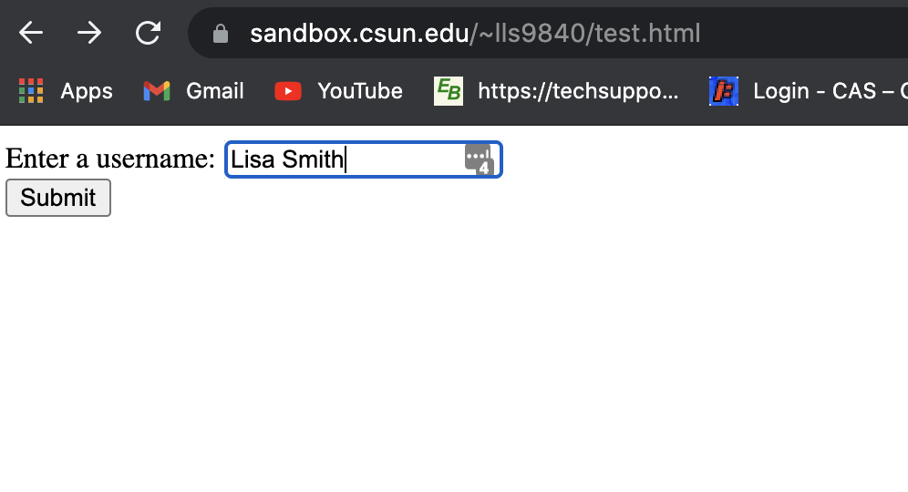
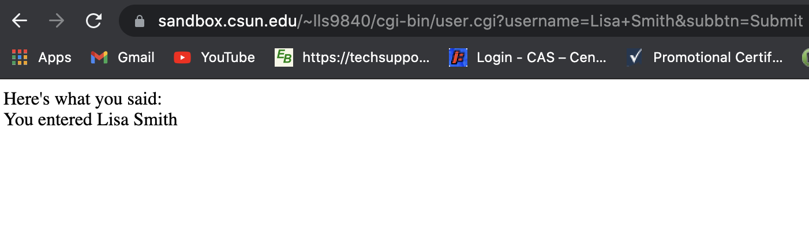

# CGI: An Output Filter

The archicture of a webserver includes a number of operations that can be organized on two axis: the processing axis and the data axis.  The data axis includes operations that filter either the HTTP request (an input filter) or the HTTP response (an output filter).  A CGI script is a special case of an output filter.  A user can create a simple program that reads input from stdin (0), performs some processing, and then writite output onto stderr.  The only thing special about this program is that it must confirm to the CGI protocol.

[Common Gateway Interface](https://en.wikipedia.org/wiki/Common_Gateway_Interface) (CGI) defines the communication protocol between the web server and a program. The web server creates a child process to run the program, with specific information provided to the process via the environment. The process can then read the HTTP request from it's stdin (0) file and write it's results to it's stdout (1) file. The web server can then send the information on the child's stdout bac to the web client (e.g., a web browser).

# CGI Variables
The following variables are defined by CGI
  * GATEWAY_INTERFACE: CGI/1.1
  ---
  * REQUEST_METHOD: e.g., HEAD, GET, POST
  * REQUEST_URI: the URI of the requested document
    - SCRIPT_NAME: the prefix of the URI that comes before the query mark
    - PATH_INFO: the postfix of the URI that comes before the query mark
    - QUERY_STRING: the part of the URI that follows the query mark (?)
  * SERVER_PROTOCOL: HTTP/1.1
  ---
  * CONTENT_TYPE: declares the type of content included in the HTTP response body
  * CONTENT_LENGTH: the size of the HTTP request body in bytes 
  ---
  * HTTP_HOST: the name of the host contained with the URL
  * SERVER_NAME: the name of the server processing the CGI script
  * SERVER_PORT: the TCP port number used to connect to the HTTP_HOST
  ---
  * SCRIPT_FILENAME: the absolute filename associated with SCRIPT_NAME
  ---
  * HTTP_USER_AGENT: a string the defines the program used to make the HTTP request
  
# Purpose
The purpose of this project is to provide you with some practical experience writting CGI scripts.  The project will also provide you with a better understanding of the overal architecture of a HTTP server.

# Submission
You remote repositoy needs to contain the following files:
 - hello.cgi 
 - goodbye.cgi
 - headers.cgi
 - user.html
 - user_response.cgi

## Initial setup
1. log into ssh.sandbox.csun.edu
2. create the directory: ~/public_html/cgi-bin
3. update the permissions on the directory ~/public_html/cgi-bin
4. clone your repo into the ~/public_html/cgi-bin

## Script - hello.cgi
1. Copy the hello.cgi program from the scripts directory to the main directory
2. View the file via a browser
3. Modify the content type to allow the program to render as  html
4. Update the program to allow the program to be executed
5. Validate the program works correctly by:
   - running the program via the command line
   - running the program via curl
   - running the program via a web browser

## Script - goodbye.cgi
1. Create a new program called `goodbye.cgi` akin to `hello.cgi`
2. Validate the program works correctly by:
   - running the program via the command line
   - running the program via curl
   - running the program via a web browser

## Script - headers.cgi

Within a CGI program, you can add any field you want. There is a set of predefined response fields. Review the set of documented response fields as defined via [Wikipedia](https://en.wikipedia.org/wiki/List_of_HTTP_header_fields) 

1. Copy your `hello.cgi` script to `headers.cgi`
2. Include the following field to your script
   ```
   X-cit-384-student: $USER
   ```
3. Add at least two more additional fields
4. Validate the program works correctly by:
   - running the program via the command line
   - running the program via curl
   - running the program via a web browser


## HTML FILE - user.html
Let's create a simple HTML file named `user.html` that will be a simple form. When the user hits the submit button it will trigger a cgi script which will display the data input into the user.html form.  

1. Create an html file that simply asks the user to enter a username. The html file should include the following elements:
 - Head element
 - Body element 
 - Form element (use the GET method in the Form action)
 - Input elements

At this point you should be familiar with the Head and Body elements in an html file. Let's take a quick look at some of the new elements being used in this lab:

What are form elements?  
A `<form>` element is a container for different types of input elements, such as: text fields, checkboxes, radio buttons, submit buttons and more.

What are input elements?  
The `<input>` element represents a typed data field, usually with a form control to allow the user to edit the data. The type attribute controls the data type (and associated control) of the element.

Here is a link to [information about HTML Forms](https://www.w3schools.com/html/html_forms.asp)

Here is an example of the form:

 

## Script - user_response.cgi
Now that we have our HTML in place we are going to create a CGI script that will echo out the username entered on our form.   

1. Create a file named `user_response.cgi
   Here is some code to get you started. 
   ```
    #!/bin/bash

    USERNAME=${QUERY_STRING#*username=}
    USERNAME=${USERNAME%%&*}
    USERNAME=${USERNAME//+/ }

    .... Additional code goes here
   ```
2. Insert appropriate HTTP response headers to your program
3. Validate the program works correctly by:
   - running the program via a web browser

Here is an example of the cgi script:

